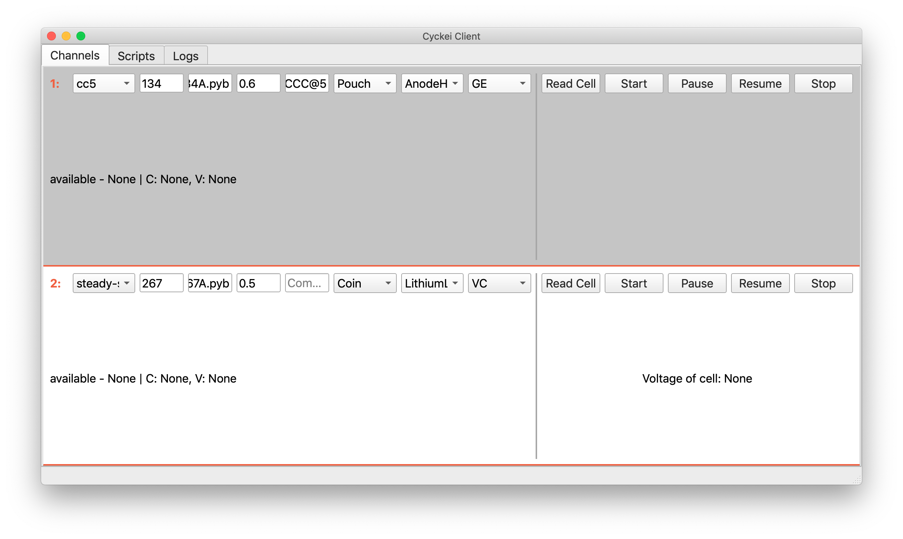

.. Cyckei documentation master file, created by
   sphinx-quickstart on Sun Jul 21 00:05:20 2019.
   You can adapt this file completely to your liking, but it should at least
   contain the root `toctree` directive.

Welcome to Cyckei's documentation!
==================================

.. toctree::
   :maxdepth: 2
   :caption: Contents:

   install
   usage
   contributing

About the Cyckei Project
------------------------
Cyckei is a battery cycling application designed to carry out charging, discharging, and data collection on lithium-ion cells. It is designed to interface with the Keithley 2602A/B SourceMeter for calorimetry testing, but could be used in a variety or setups.

The application uses a Python-like scripting format in order to write cycles that are carried out on cells. To learn more about scripts, read the :ref:`Creating Scripts` section or look at the example below.

::

    for i in range(3):
      AdvanceCycle()
      CCCharge(0.1, reports=(("voltage", 0.01), ("time", ":5:")), ends=(("voltage", ">", 4.2), ("time", ">", "4::")))
      CCDischarge(0.1, reports=(("voltage", 0.01), ("time", ":5:")), ends=(("voltage", "<", 3.0), ("time", ">", "4::")))
      Rest(reports=(("time", "::1"),), ends=(("time", ">", "::15"),))

Cyckei is open source, and we encourage users to modify the code to fit a given setup. Details on contributing to the project are in our :doc:`contributing` section.

Cyckei is currently developed and maintained by Gabriel Ewig and Vincent Chevrier at Cyclikal, LLC. For more information about Cyclikal, visit `cyclikal.com`_.

  Screen shot of Cyckei channel tab on Mac OS.

.. _cyclikal.com: http://cyclikal.com
