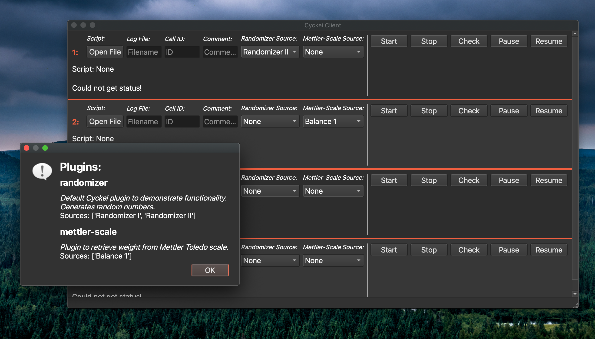

Plugins
=======

.. _Host System Setup:

Plugin Overview
-----------------
Although the base version fo Cyckei is designed to control and capture data from Keithley SourceMeters, the functionality can be extended with plugins.
Plugins aim to support simultaneous data collection with additional instruments that can interface with a computer.
This requires that the data capturing eventually be queried and returned by python code, but the method that this is done is very flexible.

Installation
----------
Some plugins may be included in your default Cyckei installation.
Upon the first launch, packaged plugins will be installed, and a new configuration will be created for each plugin if necessary.
Additional or custom plugins can be installed by adding them to the ``~/Cyckei/plugins`` folder and then enabling them in the ``plugins`` section of Cyckei's main ``config.json``.
It is possible that some plugins will have additional requirements, which are specified in their generated configuration file.

In order to prevent custom plugins being overwritten, Cyckei will not automatically update existing plugins with those packaged in an installation.
In the case that a newer version of Cyckei includes an updated plugin, the existing plugin be manually removed by deleting the ``plugin.py`` file, and restarting Cyckei.

Configuration
-------------
Upon Cyckei's first run with a new plugin, the default configuration for that plugin will be established in the plugins folder with the name ``plugin.json``.
Below is an example configuration for the included ``randomizer`` which serves as an example.

.. code-block:: json

  {
    "name":  randomizer,
    "description": "Generates random numbers to demonstrate functionality.",
    "requirements": [],
    "sources": [
      {
          "readable": "Randomizer I",
          "port": "1",
          "range": [1, 10]
      },
      {
          "readable": "Randomizer II",
          "port": "2",
          "range": [11, 20]
      }
    ],
  }

The configuration includes a number of reference values such as a description, name, and required packages.
It also has a list of sources that can be assigned to different channels.
The ``mettler-scale`` plugin, for example, has the ability to interface with multiple scales, and declares them as several sources.
The cyckei interface then has the ability to assign different scales to individual channels for data capture.
The exact parts of each source entry may depend on the individual plugin, but a port number and readable name are pretty standard.
Port numbers and other information should be changed as necessary for your setup.

Running
-------
Once configured, the different data sources exposed by plugins will be visible in the Cyckei Client.

Once available, it is as simple as selecting the source in the corresponding dropdown to assign a device to each channel.
Once assigned, data from the device will be merged into the output file for that channel.

Custom Plugins
--------------
Custom plugins are simple to create, especially if there is an established method of reading device data into python already.
It is recommended that you follow the scheme of the randomizer plugin, shown below.

::

  import logging
  from random import randint
  from os.path import basename, join
  import json

  logger = logging.getLogger('cyckei')

  DEFAULT_CONFIG = {
      "name":  basename(__file__)[:-3],
      "description": "Generates random numbers to demonstrate functionality.",
      "requirements": [],
      "sources": [
          {
              "readable": "Randomizer I",
              "port": "1",
              "range": [1, 10]
          },
          {
              "readable": "Randomizer II",
              "port": "2",
              "range": [11, 20]
          }
      ],
  }

  class DataController(object):
      def __init__(self, path):
          logger.info("Initializing Random Recorder plugin")

          self.name = DEFAULT_CONFIG["name"]
          with open(join(path, "plugins",
                         f"{self.name}.json")) as file:
              self.config = json.load(file)

      def match_source_attributes(self, source):
          for source_attribute in self.config["Sources"]:
              if source_attribute["readable"] == source:
                  return source_attribute
          logger.critical("Could not match plugin source.")

      def read(self, source):
          attr = self.match_source_attributes(source)
          logger.debug("Generating random integer...")
          return randint(attr["range"][0], attr["range"][1])

The main component of any plugin is the ``DataController`` class.
This class initializes the device as necessary, and has a ``read()`` function that is called whenever Cyckei requests information.
The ``match_source_attributes`` function isn't strictly necessary, but helps to find the correct source when multiple are initialized.

Another good example is the ``mettlerscale`` plugin, which gathers data from a Mettler-Toledo balance.
In addition to having a ``read()`` function, this plugin utilizes a ``MettlerLogger`` object to interact with each individual scale on a different port.
