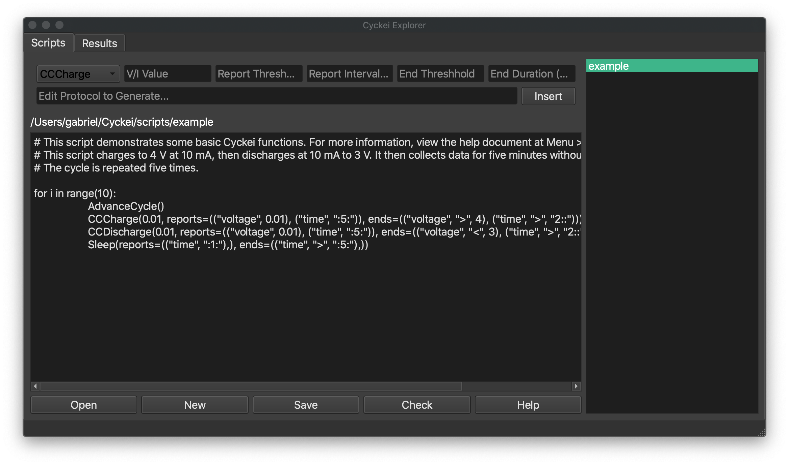
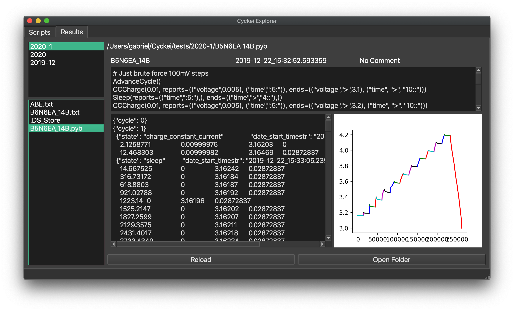

Using Cyckei
============

First Launch
------------

Upon first launch, Cyckei will create a ``cyckei`` directory in the
user's home folder to hold scripts, test results, logs, and
configuration. Before running tests, Cyckei must be configured to
properly interface with any devices. Each channel should be setup in the
``config.json`` file with the correct GPIB address and any other
relevant information. A default configuration is automatically
generated, and instructions on further configuration can be found in the `Editing Configuration`_ section.

Starting a cycle
----------------

Various attributes of the cycle may be set in before starting a cycle:

+----------------+------------+-------------------------------------------------------------------------+----------------------+
| Option         | Type       | Description                                                             | Default              |
+================+============+=========================================================================+======================+
| Script         | file       | Script with desired protocol. Gives option to select any local file.    | First scanned file   |
+----------------+------------+-------------------------------------------------------------------------+----------------------+
| Log file       | text       | Path to output file. Placed in the specified logs folder.               | "default.pdb"        |
+----------------+------------+-------------------------------------------------------------------------+----------------------+
| Cell ID        | text       | Identification for cell. Recorded to output file.                       | 0                    |
+----------------+------------+-------------------------------------------------------------------------+----------------------+
| Comment        | text       | Requester's comment for cycle. Recorded to output file.                 | ""                   |
+----------------+------------+-------------------------------------------------------------------------+----------------------+

The available buttons can be used to Start, Stop, Pause, or Resume the
protocol.

.. _Creating Scripts:

Creating Scripts
----------------

Scripts can be created in the separate explorer application. This editor
will automatically load the default included scripts, but can be used to
open and edit any local files.

The explorer includes a protocol generator above the editor to streamline script creation.
This can be used to specify attributes, and insert generated lines of code into the script.

Scripts are written in regular python code, and can contain loops and
other statements to control cycle flow. There are seven built in
protocols to control the cycler. Most of these protocols take some or
all of the following parameters:

+-------------+--------------------------------------------------------------------------------------+------------------------------------------------------------------------+
| Parameter   | Description                                                                          | Format                                                                 |
+=============+======================================================================================+========================================================================+
| Value       | Set a certain voltage or current to run at.                                          | float                                                                  |
+-------------+--------------------------------------------------------------------------------------+------------------------------------------------------------------------+
| Reports     | Set intervals of time and/or change in voltage or current to record at.              | reports=(("current", *float*), ("time", "*int*:*int*:*int*"))          |
+-------------+--------------------------------------------------------------------------------------+------------------------------------------------------------------------+
| Ends        | Set threshold of time and/or change in voltage or current to end current protocol.   | ends=(("current", "<", *float*), ("time", ">", "*int*:*int*:*int*"))   |
+-------------+--------------------------------------------------------------------------------------+------------------------------------------------------------------------+

The following protocols are available:

+----------------+-------------------------------------------------------------+------------------------+-------------------------------------------------------------------------------------------------------------------------+
| Protocol       | Description                                                 | Parameters             | Example                                                                                                                 |
+================+=============================================================+========================+=========================================================================================================================+
| AdvanceCycle   | Start recording under next cycle in output file.            | None                   | AdvanceCycle()                                                                                                          |
+----------------+-------------------------------------------------------------+------------------------+-------------------------------------------------------------------------------------------------------------------------+
| CCCharge       | Charge at a set current.                                    | Value, Reports, Ends   | CCCharge(0.1, reports=(("voltage", 0.01), ("time", ":5:")), ends=(("voltage", ">", 4.2), ("time", ">", "4::")))         |
+----------------+-------------------------------------------------------------+------------------------+-------------------------------------------------------------------------------------------------------------------------+
| CCDischarge    | Discharge at a set current.                                 | Value, Reports, Ends   | CCDischarge(0.1, reports=(("voltage", 0.01), ("time", ":5:")), ends=(("voltage", "<", 3.0), ("time", ">", "4::")))      |
+----------------+-------------------------------------------------------------+------------------------+-------------------------------------------------------------------------------------------------------------------------+
| CVCharge       | Charge at a set voltage.                                    | Value, Reports, Ends   | CVCharge(4.2, reports=(("current", 0.01), ("time", ":5:")), ends=(("current", "<", 0.005), ("time", ">", "24::")))      |
+----------------+-------------------------------------------------------------+------------------------+-------------------------------------------------------------------------------------------------------------------------+
| CVDischarge    | Discharge at a set voltage.                                 | Value, Reports, Ends   | CVDischarge(4.2, reports=(("current", 0.01), ("time", ":5:")), ends=(("current", "<", 0.005), ("time", ">", "24::")))   |
+----------------+-------------------------------------------------------------+------------------------+-------------------------------------------------------------------------------------------------------------------------+
| Rest           | Record at a set interval.                                   | Reports, Ends          | Rest(reports=(("time", "::1"),), ends=(("time", ">", "::15"),))                                                         |
+----------------+-------------------------------------------------------------+------------------------+-------------------------------------------------------------------------------------------------------------------------+
| Sleep          | Record at a set interval and turn channel off in between.   | Reports, Ends          | Sleep(reports=(("time", ":1:0"),), ends=(("time", ">", "::15"),))                                                       |
+----------------+-------------------------------------------------------------+------------------------+-------------------------------------------------------------------------------------------------------------------------+

An example script is shown below. There is also a simple script saved in
the scripts folder which is available whenever the client is started.

::

  for i in range(3):
    AdvanceCycle()
    CCCharge(0.1, reports=(("voltage", 0.01), ("time", ":5:")), ends=(("voltage", ">", 4.2), ("time", ">", "4::")))
    CCDischarge(0.1, reports=(("voltage", 0.01), ("time", ":5:")), ends=(("voltage", "<", 3.0), ("time", ">", "4::")))
    Rest(reports=(("time", "::1"),), ends=(("time", ">", "::15"),))

Scripts are automatically checked when they are sent to the server. They
can also be manually checked by clicking the "Check" button below the editor.
Checking a script ensures that (1) the script only contains
legal arguments and (2) can be loaded by the server without immediate
errors. Checking your scripts is a good practice to mitigate possible
formatting issues and errors. However, care should still be taken while
writing scripts as they are executed as any other python code within the
application.

Using Plugins
-------------

Data plugins are available to supplement current and voltage data measurements.
The plugin scheme is designed to be flexible in order to support any device with the use of custom configuration.
A random plugin is included by default with the Cyckei distribution.
Other plugins can be written by developing a similar DataController object and including it in the ``plugins`` folder of the Cyckei recording directory.
Below is an example plugin for reference.

.. code-block:: python

  import logging
  from random import randint

  logger = logging.getLogger('cyckei')

  class DataController(object):
      def __init__(self):
          self.name = "random"
          logger.info("Initializing Random Recorder plugin")

      def read(self):
          logger.debug("Generating random integer...")
          return randint(1, 101)

Viewing Logs
------------

Logs are created to document measurements from each cell throughout it's
cycle. They also have details about the cell and the cycle that was run
on it. Log files are saved to the ``tests`` folder specified in the
configuration under the specified name. To view a log from the client
application, just open the explorer application . All logs are automatically
loaded on startup, and new or updated ones can be viewed after clicking
reload. Although you can copy the contents of a log file to an excel
spreadsheet, log files *should not* be opened with excel or another
application directly. Doing this can cause the file to become locked and
prevent Cyckei from editing it.

.. _Editing Configuration:

Editing Configuration
---------------------

Editing the configuration file is crucial for the client to function
properly. Any custom configuration files should be written in JSON and
should mirror the default config.json in the program's root directory.
Each section is described in more detail below:

-  **channels** - A list of channels currently connected to the computer.

   -  *channel (string)* - Channel number for identification within the application.
   -  *gpib\_address (int)* - Hardware address of GPIB interface can be found with a NI VISA application or wth the code in :ref:`Host System Setup`.
   -  *keithley\_model (string)* - Model number of keithley being used.
   -  *keithley\_channel (string)* - Particular channel on said keithley (a or b).

-  **zmq** - A dictionary of properties that control how the client and
   server communicate.

   -  *port (int)* - Port to communicate over.
   -  *client-address (string)* - Address for the client to connect to. Usually localhost.
   -  *server-address (string)* - Address for the server to listen on. Usually all.
   -  *timeout (int)* - Number of seconds to wait for server response. 10 seconds seems to work well for most configurations.

- **data-plugins** - A list of data plugins to load and execute alongside normal data collection.
  Plugins should be placed in the ``plugins`` directory of the Cyckei recording folder.

- **device** - The identifier for which device to load. Currently, ``keithley2602`` is the only acceptable model.

-  **verbosity** - The amount of information to be saved to log files.
   Generally should be set to 20, but the following levels can also be
   used. Lower values print more information for debugging purposes.

   -  *Critical* - 50
   -  *Error* - 40
   -  *Warning* - 30
   -  *Info* - 20
   -  *Debug* - 10
   -  *Notset* - 0

Here is an example configuration file for a simple setup running on port
5556 with one Keithley with address 5:

.. code-block:: json

  {
      "channels": [
          {
              "channel": "1",
              "gpib_address": 5,
              "keithley_channel": "a"
          },
          {
              "channel": "2",
              "gpib_address": 5,
              "keithley_channel": "b"
          }
      ],
      "zmq":{
          "port": 5556,
          "client-address":"tcp://localhost",
          "server-address":"tcp://*",
          "timeout": 10
      },
      "data-plugins": [
        "temperature"
      ],
      "device": "keithley2602",
      "verbosity": 30
  }

.. _GitLab: https://gitlab.com
